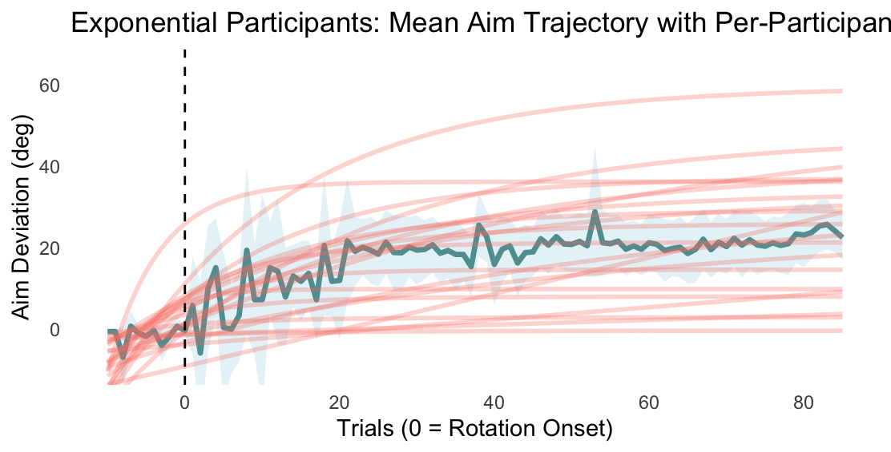
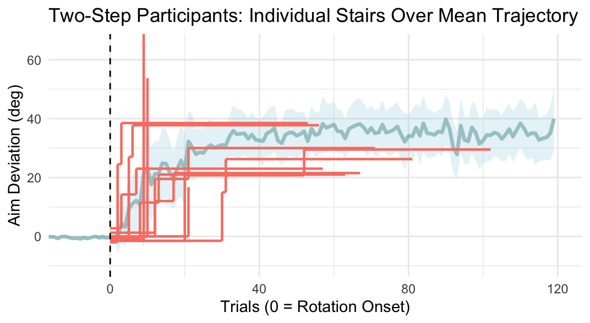

# Overview

When participants experience a cursor rotation while making a reach to a
target, they must compensate by deviating their hand movement in order
to get a cursor straight to its target.

In this experiment, participants learned to counter a rotation and were
instructed to report their aiming strategy by changing the direction of
an arrow.

Rotation sizes introduced were 20, 30, 40, 50, and 60 degrees

<br>

# Data

We will be exploring: <br>1. The proportion of learners within each
perturbation condition. <br>2. The proportion of aiming strategies as a
function of rotation size. <br>3. The onset of an aiming strategy as a
function of rotation size. <br>4. The magnitude of the aiming strategy
as a function of rotation size.

# Setup

Get necessary packages:

##renv
```{r}

if (!requireNamespace("renv", quietly = TRUE)) install.packages("renv")
library(renv)

renv::restore(prompt = FALSE)

```


```{r}
library('remotes')
ip <- installed.packages()
if ('Reach' %in% ip[,'Package']) {
  if (ip[which(ip[,'Package'] == 'Reach'),'Version'] < "2025.02.16") {
    remotes::install_github('thartbm/Reach')
  }
} else {
  remotes::install_github('thartbm/Reach')
}
```


Source project code:

```{r}
# load sources for this project
source("R/data.R") 
source("R/newcode.R") 
source("R/AimHistograms.R") 
source("R/AimDevPlot.R") 
source("R/newstats.R") 
source("R/Modeling/EXPvsSTEP.R") 
source("R/Clustering/NewUnsuper.R") 
source("R/Reach Data/ReachDevPlot.R")
source("R/Reach Data/IndividualReaches.R")
```

Download Files
```{r}
getData()
```

## Analysis

### Learning

Did all participants learn to counter the perturbation at least 50% of
the time?

```{r}
getLearners()
```

This is determined by ensuring the reachadeviation_deg median of the
final 16 rotated trials is greater than 50% of the rotation magnitude
recieved.

Filter out non-learners

```{r}
LearnerCSV()
```

We can plot participant reach deviations to show the magnitude of
learning per rotation group

```{r}
plotREACH()

```

### Aiming

[Aiming analysis script](newcode.R)

Did all learners have a strategy (ie, deviate their aim)?

```{r}
strategySummary()
```

We can use a 95% CI approach to determine strategy-users. A strategy
will be defined to: 1) Within the last 8 trials of the rotation phase,
each CI bound must be above 0 degrees 2) The lower bound must be above 5
degrees to account for motor noise

For further analysis, we can create a csv file for only strategy users.

```{r}
Strategyfile()
strat_data <- read.csv("data/strategy_only_participants.csv")
```

#### Statistics

[Aiming stats script](newstats.R)

1)  Does final aligned and first rotated differ from \~0

```{r}
zeroT()


```

Here we took the mean final 8 aligned and mean final 8 rotated per
participant and ran 5 paired T-tests per rotation group. All tests
reveal significance.

2)  Is strategy enagagement predicted by rotation size?

```{r}
logAnalysis()
```

The odds of using an explicit strategy are much higher in the 40°, 50°,
and 60° rotation groups compared to the 20° group.

3)  Does aim magnitude vary across rotation sizes?

```{r}
aimAOV()
```

Taking the mean from the last 16 trials, One way anova shows an effect
of rotation size. Post-hoc tukey shows that the 60 degree group produces
a higher aim strategy than all other groups.

4)  Does aim variance vary across rotation sizes?

```{r}
aimvarAOV()
```

Taking the sd from the last 16 trials, one way anova shows an effect of
rotation size. Post-hoc tukey shows that participants in the 60°
rotation group show significantly greater variability in their final
performance than participants in the 20°, 30°, and 40° groups.

5)  Is there an effect of rotation size on strategy-onset?

```{r}
startTrialAOV()
```

#### Visualization

**Aiming Behaviour**

```{r}
plotAIM()
```

Next, we can look at all aim data across individuals to predict visually
if explicit learning follows and exponential vs stepwise process

**Simulated Data:**

```{r}
plot_step_histogram(step_data_var_jump)
```

```{r}
plot_step_histogram(exp_data)
```

**Observed Data:**

```{r}
plot60aim()
```

```{r}
plot50aim()
```

```{r}
plot40aim()
```

```{r}
plot30aim()
```

```{r}
plot20aim()
```

Aiming Onset

### Is explicit learning an exponential process?

[Model Fits script](EXPvsSTEP.R)

First, we can fit models to aimdeviation_deg data of each participant.
Three models we can use are

1)  Step model - Do participant deviate their aim in 1 step and does
    this aim stay stable?

2)  Two-step model - Do participants deviate their aim once (ie, around
    15 degrees) and modify their step again (ie, around their rotation
    size)?

3)  Exponential - Do particpants deviate their aim in small incremental
    steps till it reaches their max aim deviation?

For protocol see: [Open data analysis
notebook](modelfittingprotocol.Rmd)

```{r}
fitAllModels()

```

```{r}
#chi-sq test
ModelChi()
ModelRotChi()
```

54 participants do not fit with the exponential model (n=42 for
one-step). A chi-squared test revealed that significantly more
participants were classified as one-step than exponential (p \<0.001)




{width="360"}

### Are there 'patterns' in strategy development among participants?

Inspired by Tsay et al. 2024 which suggested distinct classifications of
strategies. We can thus implement a similar cluster analysis to
determine if we can observe similar patterns through three methods

**1) Unsupervised k-means algorithm using particiant-based  features**

- First, we need to define a 'learning phase' finding the point of strategy onset to  when a strategy becomes stable. Using a rolling window   analysis approach, we can conduct a t.test analysis to see when a participant's strategy deviates from 0, to when a startegy deviates from   the average of the final 16 rotated trials

```{r}
getLearningPhase()
```
- Now we can establish features that captures the variance in strategy development.
- FEATURE 1: SD of of aim within the learning phase
- FEATURE 2: length of learning phase
- FEATURE 3: mean absolute difference of each trial in the learning phase

```{r}
getFeatures()
```

We can conduct a PCA, and run kmeans on the top two informative PCA components
```{r}
kMeans()
```

Visualize Clusters!!
```{r}
plotCluster()
```
```{r}
PCAPlot()
```

We can see patterns of a step, gradual, and erratic strategy type
```{r}
#visualize count in stacked bar plot
stackedPlot()
```


Manually label participants and compare via confusion matrix
```{r}
compare()
```

## Strategy type per rotation group
```{r}
learning_phase_table()
##note: a lot is being output here but there are 3 tables for erratic, gradual, and step.
```
#Density plots

```{r}
#Density of step onset for step-learners
plotStepOnsetDensity()
```

```{r}
#Density of strategy onset for erratic-learners
plotExplorationDensity()
```

```{r}
#When stable strategy is reached for step-learned
stepStableDensity()
```

```{r}
#When stable strategy is reached for all-learners
plotAllStable()
```

#Stats
```{r}
#Correlation of step size and magnitude (with normalized rotation)
lmStats()
```
Both predictors are highly significantm meaning:
  (1) step size still matters, even when controlling for rotation.
  (2) rotation size also independently drives final strategy.


```{r}
# Does aim magnitude depend on rotation size for step users?
aimStep()
```
- Yes! F-test:p=0.001. 
- 60 group differs with 50,30,30, but not 20 (p=0.053)

```{r}
#For all strategy-users is time till stable strategy predicted by rotation size?
allStableTime()
```
No. p= 0.76

```{r}
#For all strategy-users is magnitude of stable strategy predicted by rotation size?
allStableAim()
```
Yes! 

We can visualize finaly strategy across rotation sizes
```{r}
allFinalBar()
```


### Final Analysis - Individual reaches

Visually, do cursor reaches resemble an exponential or stepwise
function?

```{r}
plot60reach()
```


-   Definitely resembles an exponential function, but lets do model fits
    with reachdeviation_deg

-   Same code for aiming

    ```{r}
    fitReachModels()
    ```

-   Most participants' cursor reaches fit the exponential model (59/75)
