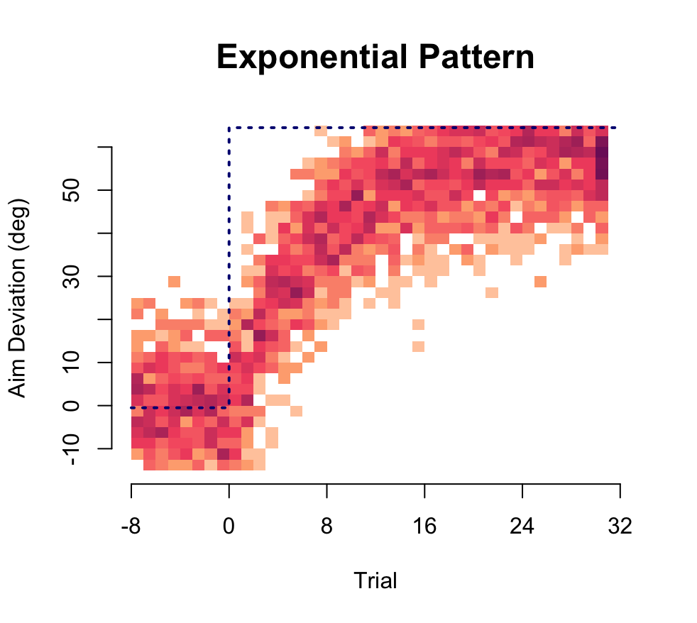
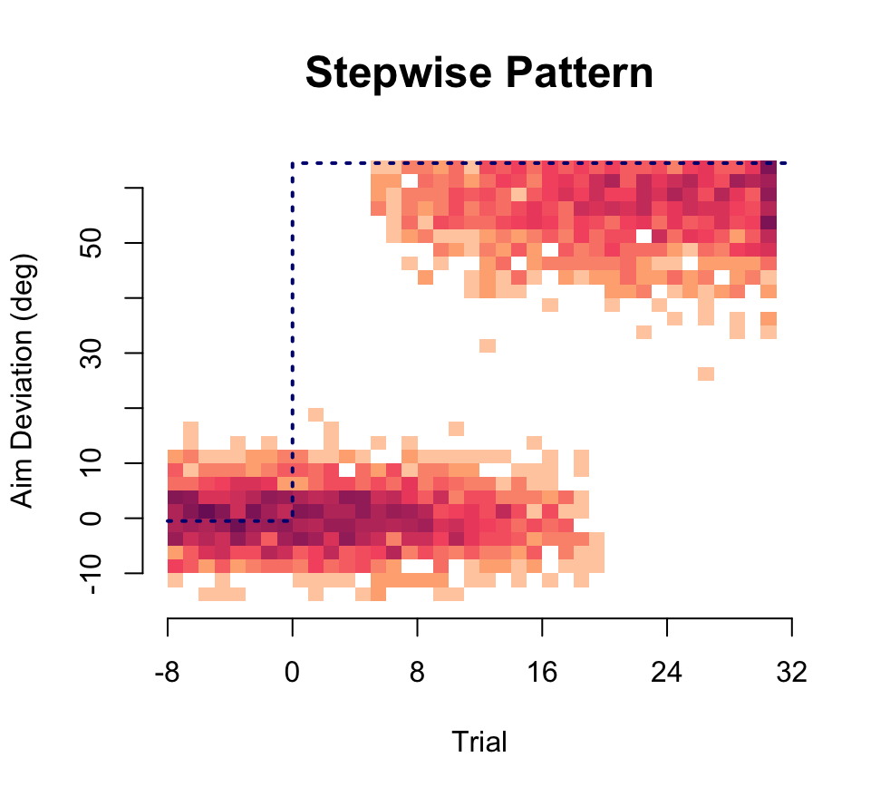
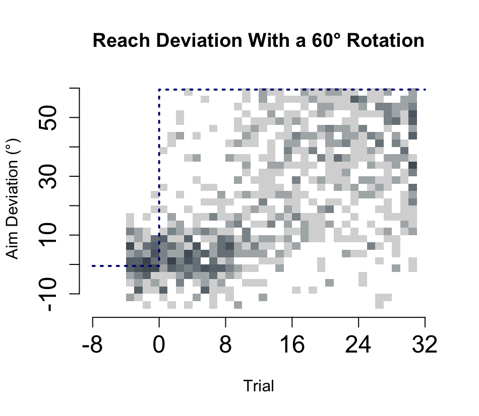
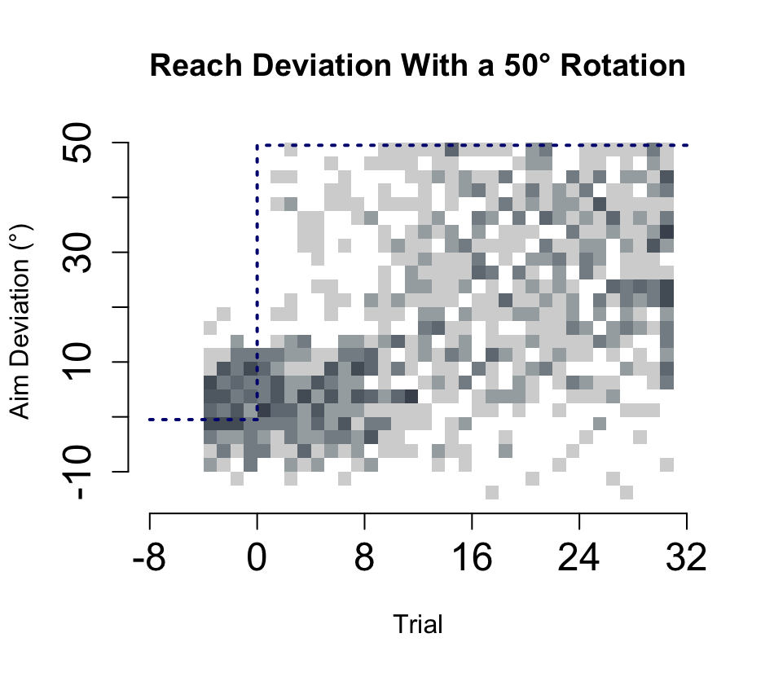
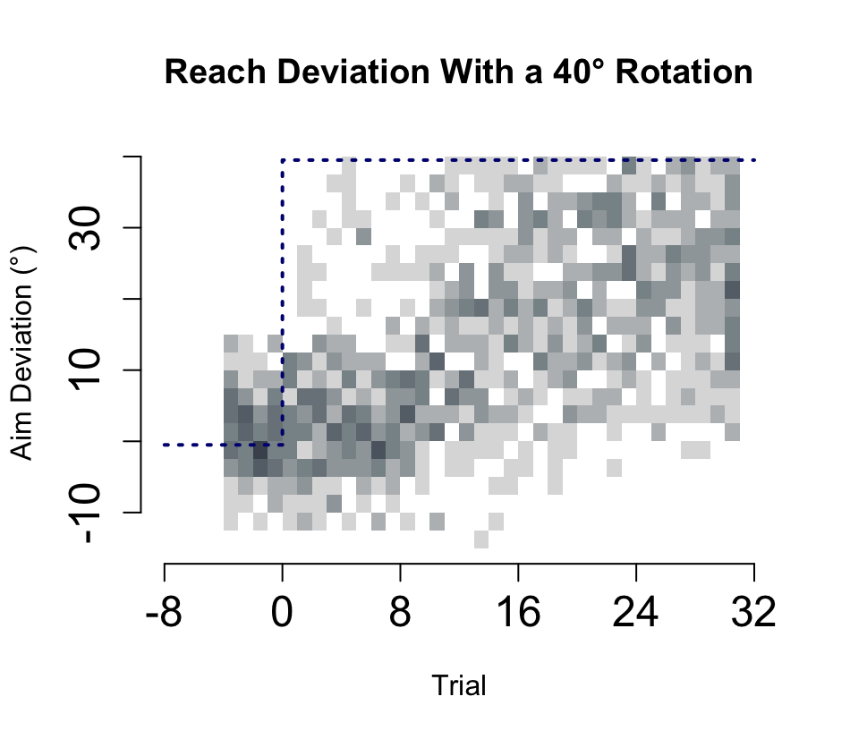
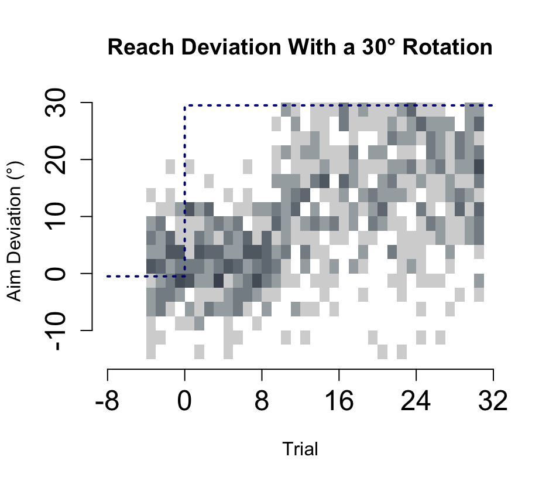
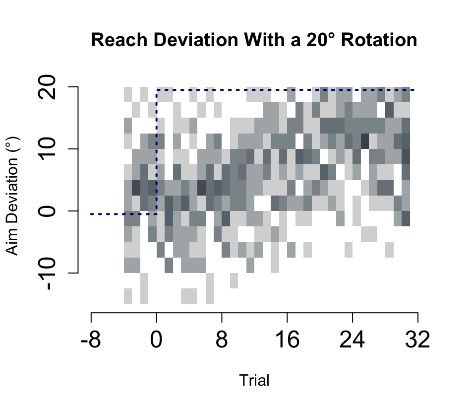

# Overview

When participants experience a cursor rotation while making a reach to a
target, they must compensate by deviating their hand movement in order
to get a cursor straight to its target.

In this experiment, participants learned to counter a rotation and were
instructed to report their aiming strategy by changing the direction of
an arrow.

Rotation sizes introduced were 20, 30, 40, 50, and 60 degrees

<br>

# Data

We will be exploring: <br>1. The proportion of learners within each
perturbation condition. <br>2. The proportion of aiming strategies as a
function of rotation size. <br>3. The onset of an aiming strategy as a
function of rotation size. <br>4. The magnitude of the aiming strategy
as a function of rotation size.

# Setup

Get necessary packages:

```{r}
library('remotes')
ip <- installed.packages()
if ('Reach' %in% ip[,'Package']) {
  if (ip[which(ip[,'Package'] == 'Reach'),'Version'] < "2025.02.16") {
    remotes::install_github('thartbm/Reach')
  }
} else {
  remotes::install_github('thartbm/Reach')
}
```

Source project code:

```{r}
# download and handle data:
source("R/data.R") 
source("R/newcode.R") 
source("R/AimHistograms.R") 
source("R/AimDevPlot.R") 
source("R/newstats.R") 
source("R/Modeling/EXPvsSTEP.R") 
source("R/Clustering/UnsuperTrial.R") 
source("R/Clustering/SupervisedClassification.R") 
source("R/Clustering/InformedFits.R") 
source("R/Reach Data/ReachDevPlot.R")
source("R/Reach Data/IndividualReaches.R")
```

Download Files

```{r}
downloadData()
getData()
```

## Analysis

### Learning

Did all participants learn to counter the perturbation at least 50% of
the time?

```{r}
getLearners()
```

This is determined by ensuring the reachadeviation_deg median of the
final 16 rotated trials is greater than 50% of the rotation magnitude
recieved.

Filter out non-learners

```{r}
learner_id <- getLearners()
total_learners_data <- LearnerCSV(learner_id)
```

We can plot participant reach deviations to show the magnitude of
learning per rotation group

```{r}
setupREACH(total_learners_data)
plotREACH(total_learners_data)

```

### Aiming

[Aiming analysis script](newcode.R)

Did all learners have a strategy (ie, deviate their aim)?

```{r}
getStrategies()
strategySummary()
```

We can use a 95% CI approach to determine strategy-users. A strategy
will be defined to: 1) Within the last 8 trials of the rotation phase,
each CI bound must be above 0 degrees 2) The lower bound must be above 5
degrees to account for motor noise

For further analysis, we can create a csv file for only strategy users.

```{r}
Strategyfile(total_learners_data, ci_compare)
```

#### Statistics

[Aiming stats script](newstats.R)

1)  Does final aligned and first rotated differ from \~0

```{r}
zeroT(strat_data)


```

Here we took the mean final 8 aligned and mean final 8 rotated per
participant and ran 5 paired T-tests per rotation group. All tests
reveal significance.

2)  Is strategy enagagement predicted by rotation size?

```{r}
logAnalysis()
```

The odds of using an explicit strategy are much higher in the 40°, 50°,
and 60° rotation groups compared to the 20° group.

3)  Does aim magnitude vary across rotation sizes?

```{r}
aimAOV()
```

Taking the mean from the last 16 trials, One way anova shows an effect
of rotation size. Post-hoc tukey shows that the 60 degree group produces
a higher aim strategy than all other groups.

4)  Does aim variance vary across rotation sizes?

```{r}
aimvarAOV()
```

Taking the sd from the last 16 trials, one way anova shows an effect of
rotation size. Post-hoc tukey shows that participants in the 60°
rotation group show significantly greater variability in their final
performance than participants in the 20°, 30°, and 40° groups.

5)  Is there an effect of rotation size on strategy-onset?

```{r}
startTrialAOV(result_table)
```

#### Visualization

**Aiming Behaviour**

```{r}
setupAIM(strat_data)
summarizeAIM(clean_data)
plotAIM(summary_data)
```

Next, we can look at all aim data across individuals to predict visually
if explicit learning follows and exponential vs stepwise process

**Simulated Data:**

```{r}
plot_step_histogram(step_data_var_jump)
```

```{r}
simulate_exponential_learning()
plot_step_histogram(exp_data)
```

**Observed Data:**

```{r}
plot60aim()
```

```{r}
plot50aim()
```

```{r}
plot40aim()
```

```{r}
plot30aim()
```

```{r}
plot20aim()
```

Aiming Onset

### Is explicit learning an exponential process?

[Model Fits script](EXPvsSTEP.R)

First, we can fit models to aimdeviation_deg data of each participant.
Three models we can use are

1)  Step model - Do participant deviate their aim in 1 step and does
    this aim stay stable?

2)  Two-step model - Do participants deviate their aim once (ie, around
    15 degrees) and modify their step again (ie, around their rotation
    size)?

3)  Exponential - Do particpants deviate their aim in small incremental
    steps till it reaches their max aim deviation?

For protocol see: [Open data analysis
notebook](modelfittingprotocol.Rmd)

```{r}
fitAllModels(strat_data)

```

```{r}
#chi-sq test
ModelChi()
ModelRotChi()
```

54 participants do not fit with the exponential model (n=42 for
one-step). A chi-squared test revealed that significantly more
participants were classified as one-step than exponential (p \<0.001)


{width="360"}

### Are there 'patterns' in strategy development among participants?

Inspired by Tsay et al. 2024 which suggested distinct classifications of
strategies. We can thus implement a similar cluster analysis to
determine if we can observe similar patterns through three methods

**1) Unsupervised k-means algorithm using trial-by-trial features**

-   Taking first 32 trials of the rotated phase, we summarized the trial
    of aim change (+ or - 7 degrees), variability of aim (using sd),
    average of aim, and proportion of negative aims below -3.

-   Next, we will run a pca analysis to 'summarize' the large data set
    before finding kmeans

```{r}
#table of cluster #
PCA()
```

```{r}
UnsuperPlot()
```

[Unsupervised Method script](UnsuperTrial.R)

-   3 Clusters identified: participants who make an aim change
    immediately will mild sign flips, participants who make an aim
    change late, and participants who have high variability early (and
    many sign flips) in aiming.

**2) Supervised Random Forest Analysis**

-   First, we can visually label each participant as the clusters
    defined from the first method: rapid, delayed, erratic.

-   Then, we can summarize trial features within each participant,
    taking into account 1) trial of aim dev, 2) variability of aim, 3)
    average of aim, and 4) sign flips.

-   Next, we can fit a random forest classifier (with 500 trees) to
    predict a label from the participant summary features in a leave-out
    method.

-   We can see how well the Rf predictions are with the manual labels

[Supervised Analysis](Supervisedclassifcation.R)

```{r}
RFmodel(trial_features, onset_labels)
```

```{r}
SuperPlot()

```

```{r}
#Strategy types across rotation groups
SuperRotationChi()
```

-   2 in the delayed group were mislabeled as rapid, 1 in the rapid
    group was mislabeled as delayed, 50% people in the erratic group
    were mislabeled.

```{r}
#does rotation predict supervised-predicted strategy type?
SuperRotationChi()
```

**3) Informed Model fits**

-   Last, we can fit step functions that account for:

    -   <div>

        1.  timing (early vs late)
        2.  variability (erratic)
        3.  sign flips (erratic)

        </div>

-   We can then see how these models align with the previous methods

```{r}
InformedTable(classified, rf_labels, unsupervised_labels)

```

```{r}
informedResults(strat_data)
```

[Informed Modelling Script](InformedFits.R)

-   44 participants fit to a "rapid step model"

    -   aim change within first 10 trials

-   22 participants fit to a "delayed step model"

    -   aim change after trial 10

-   9 participants fit to an "erratic step model"

    -   high sd, more than 3 sign flips

**Agreement of these methods**

Chi-sq tests can assess if these methods are in agreement

-   Unsupervised vs Supervised

    ```{r}
    cont_table <- table(filtered_data$label, filtered_data$rotation)
    chi_sq_result <- chisq.test(cont_table)
    ```

-   Informed vs Supervised:

    ```{r}
    chisq.test(all_labels$step_model, all_labels$predicted_label)
    ```

-   Informed vs Unsupervised:

    ```{r}
    chisq.test(all_labels$step_model, all_labels$unsupervised_cluster)
    ```

### Final Analysis - Individual reaches

Visually, do cursor reaches resemble an exponential or stepwise
function?

{width="233"}

{width="233"}

{width="230"}

{width="230"}

{width="230"}

{width="230"}

{width="230"}

-   Definitely resembles an exponential function, but lets do model fits
    with reachdeviation_deg

-   Same code for aiming

    ```{r}
    fitReachModels(strat_data)
    ```

-   Most participants' cursor reaches fit the exponential model (59/75)
